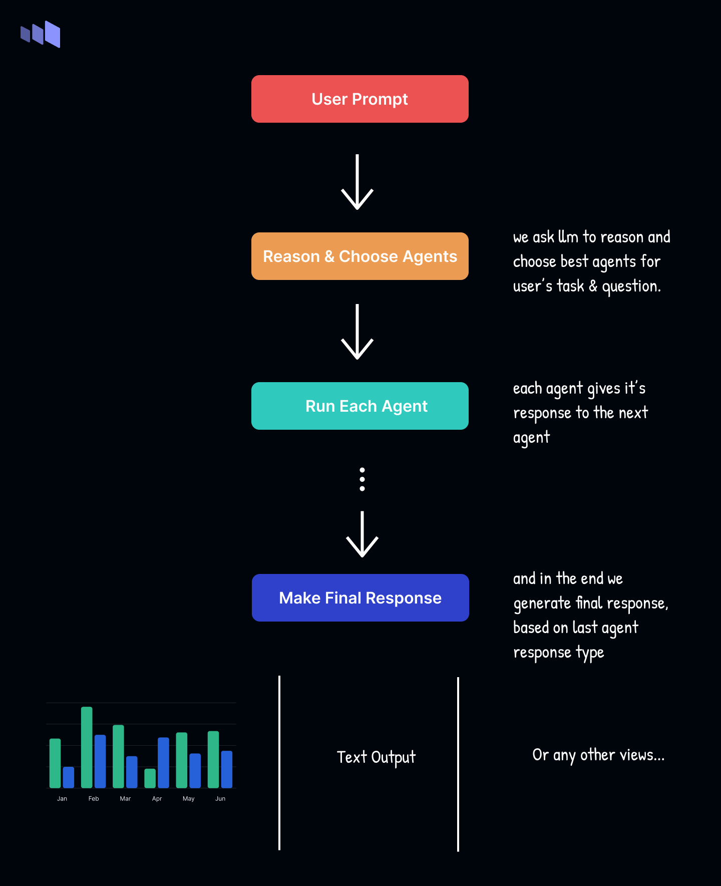

# Friday Agents

The **Friday Agents** is a JavaScript package for integrating and orchestrating multiple AI-driven tools (agents) for diverse tasks like data processing, code generation, chart creation, image generation, and more.



### Features:

- **Multi-agent orchestration**: Use multiple agents together to handle complex tasks.
- **Customizable agent configuration**: Easily configure agents like `SearchAgent`, `JsCodeAgent`, `ImageAgent`, and `ChartAgent`.
- **Flexible workflows**: Tailor each agent’s behavior and manage retries and result handling.

### Installation

```bash
npm install @friday-agents/core
```

### Usage

Here’s how to use the core package along with agents like `SearchAgent` and `ImageAgent`, showing how to configure them:

```javascript
import {
  FridayAgents,
  ChartAgent,
  JsCodeAgent,
  SearchAgent,
  ImageAgent,
} from "@friday-agents/core";

// Configure SearchAgent with an online LLM (e.g., Perplexity)
const searchAgent = new SearchAgent();
searchAgent.config = {
  endpoint: "...",
  api_key: "sk-or-v1-xx",
  model: "perplexity/llama-3.1-sonar-small-128k-online",
};

// Configure ImageAgent with API keys for FusionBrain.ai
const imageAgent = new ImageAgent();
imageAgent.config = {
  apiKey: "your-api-key-here",
  secretKey: "your-secret-key-here",
};

// Create an instance of the Friday Agent with configured agents
const fa = new FridayAgents({
  agents: [searchAgent, new ChartAgent(), new JsCodeAgent(), imageAgent],
  maxAgentRetry: 2,
  onAgentFinished(name, result) {
    console.log(`Agent finished: ${name}`, result);
  },
  onFinish(data) {
    console.log("Final result:", data);
  },
  baseLLm: {
    model: "llama3.2-8b",
    endpoint: "...",
    apikey: "xxx",
  },
});

// Run a task with a specific prompt
const result = await fa.run({
  prompt: "Generate an image of a random landscape",
  messages: [],
});

console.log(result);
```

### Key Configuration Options:

#### **SearchAgent Configuration**:

- **endpoint**: URL for the external API (e.g., Perplexity API).
- **api_key**: Your API key to authenticate requests.
- **model**: The model name or ID for the language model.

#### **ImageAgent Configuration**:

- **apiKey**: Your API key for FusionBrain.ai.
- **secretKey**: Your secret key for additional authentication.

### Key Options for `FridayAgents`:

- **agents**: Array of agent instances like `SearchAgent`, `JsCodeAgent`, `ImageAgent`.
- **maxAgentRetry**: Maximum number of retries for failed agent executions.
- **onFinish**: Callback to handle final results after all agents have finished.
- **baseLLm**: Configure the base language model (OpenAI compatible LLMs).

### Example Prompts:

- `"Generate a chart visualizing sales data for the past year"`
- `"Write a JavaScript function to calculate the Fibonacci sequence"`
- `"Find the top 5 most recent news articles on AI"`
- `"Generate an image of a futuristic city"`

### Developing Custom Agents for Friday Agents

Custom agents in **Friday Agents** allow you to extend functionality by integrating specialized tasks, like querying APIs or processing custom data. These agents inherit from the base `Agent` class and can be configured to perform specific actions (like fetching weather data, running code, or generating images).

#### Key Components:

1. **Configuration**: Each agent has a configuration that defines how it connects to external services (e.g., API keys, endpoints).
2. **View Type**: Defines the format of the result (e.g., text, image, JSON).
3. **Call Format**: Specifies how to structure the data when calling the agent (e.g., search queries or commands).
4. **Agent Logic (`onCall`)**: This is where the agent processes the input, makes external calls, and returns the result.

### Example: WeatherAgent

```javascript
import Agent from "./agent";

export interface WeatherAgentConfig {
    apiKey: string
}

export default class WeatherAgent extends Agent<WeatherAgentConfig> {
    viewType: Agent['viewType'] = "text"; // Output format as text
    name: string = "weather"; // Agent's name
    description: string = "This agent fetches real-time weather data for a given location.";

    // Returns expected query format for the agent
    callFormat(): string {
        return '{ "location": "city name or coordinates" }';
    }

    // Method to fetch weather data
    async onCall(result: string): Promise<string | null> {
        const { location } = JSON.parse(result) ?? {};
        if (!location) return null;

        // Make API call to weather service
        const res = await fetch(`https://api.weatherapi.com/v1/current.json?key=${this.config.apiKey}&q=${location}`);
        const weatherData = await res.json();

        if (weatherData && weatherData.current) {
            const { temp_c, condition } = weatherData.current;
            return `The current temperature in ${location} is ${temp_c}°C with ${condition.text}.`;
        }

        return null;
    }
}
```

### Key Concepts:

1. **Custom Config**: `WeatherAgentConfig` defines the `apiKey` and `location` needed for the weather service.
2. **callFormat**: Specifies that the agent expects a JSON object with a `location` key.
3. **onCall**: This method makes an API request to fetch weather data, processes the response, and returns the weather information.

---

In essence, developing custom agents involves:

- Defining what the agent needs (configurations, inputs, and outputs).
- Implementing the agent's behavior (how it handles requests and interacts with external APIs or services).

Once created, you can easily add your custom agent to the `FridayAgents` and automate workflows using your specialized tools!

### License

MIT License.
